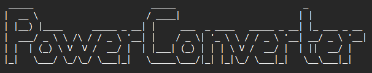

  

  
  
  
  

An image, audio & video converter supporting basic file types, written in python.

## How to run

First, download the latest release of PowerConverter [here](https://github.com/kkb3st/PowerConverter/releases/) or clone the entire repository.

### Linux 
Python should already be installed on your computer. 

Use the console to navigate to the PowerConverter directory, then type `pip install -r requirements.txt` and hit enter. \
Then type `python3 console.py` and hit enter. Now you can convert your files!

### Windows
You need Python installed on your computer. \
Download the latest version [here](https://www.python.org/downloads/) 

Then open Command Prompt, navigate to the PowerConverter directory, type `python -m pip install -r requirements.txt` and hit enter. 

Finally, open Explorer, navigate to the PowerConverter directory, then double-click `console.py`. Now you can convert your files! 

## Additional Info
This is still a very early version, so expect more stuff to be added in the future.
